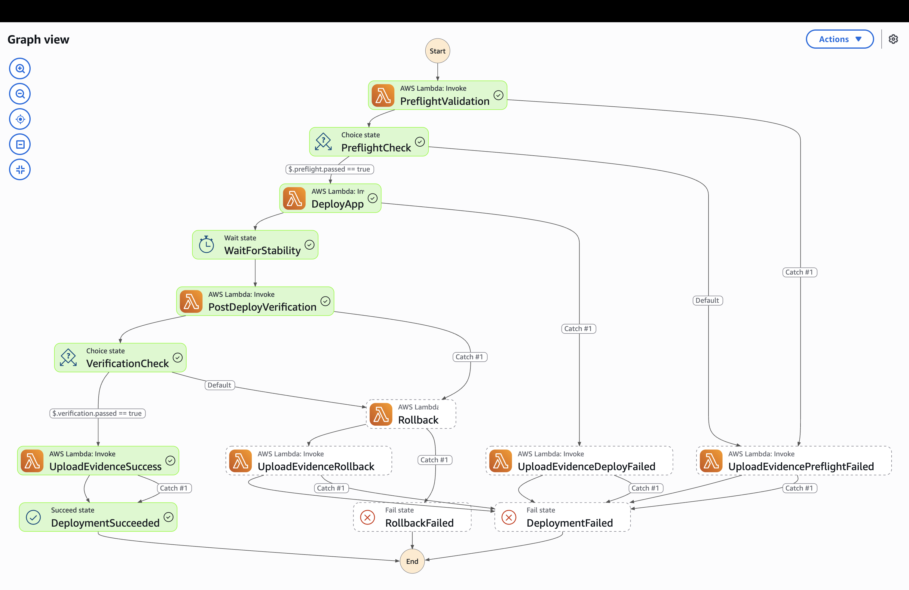
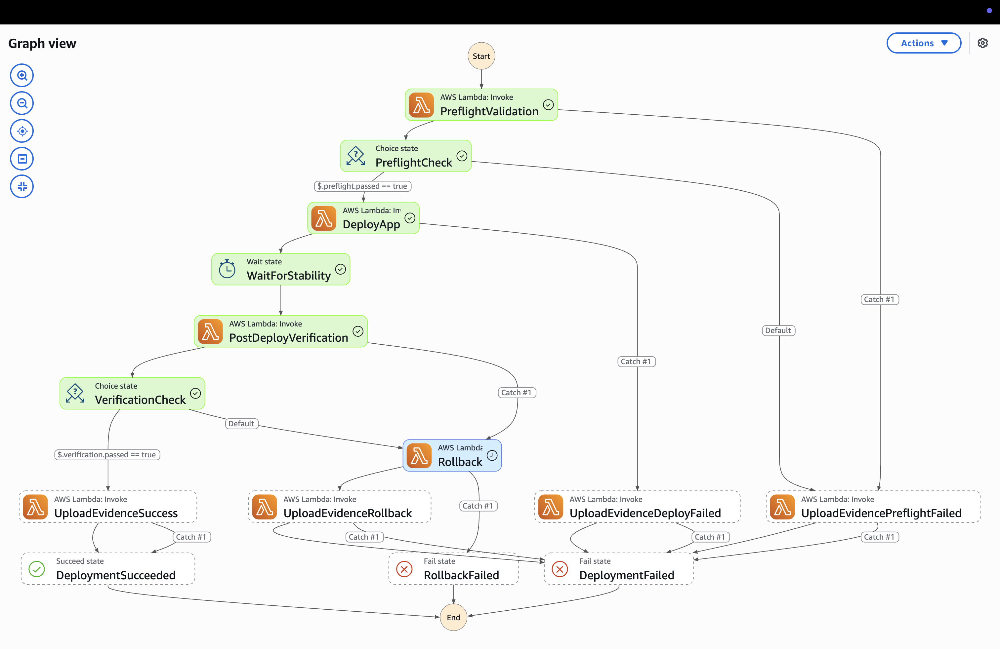

# Orchestration — NTT GCC Assignment 2

Self-Healing Deployment Workflow using AWS Step Functions + Lambda.

---

## Overview

A deployment frequently fails due to configuration drift, missing parameters, or transient AWS errors.
This workflow validates prerequisites, deploys to ECS, verifies the endpoint, and rolls back automatically on failure.
Every run—success or failure—uploads a timestamped JSON evidence artefact to S3.

**Orchestrator choice:** AWS Step Functions (Standard Workflow)
**Rationale:** Native AWS, fully managed, visual execution graph, built-in retry and error handling, integrated with Lambda and CloudWatch, no infrastructure to manage.

---

## Workflow State Machine

```
[Start]
   │
   ▼
PreflightValidation ──(error)──────────────────────────────► UploadEvidencePreflightFailed ──► DeploymentFailed
   │
   ▼ (passed=true / passed=false)
PreflightCheck ──(false)──────────────────────────────────► UploadEvidencePreflightFailed ──► DeploymentFailed
   │ (true)
   ▼
DeployApp ──(error)───────────────────────────────────────► UploadEvidenceDeployFailed ──► DeploymentFailed
   │
   ▼
WaitForStability (60 s)
   │
   ▼
PostDeployVerification ──(error)──────────────────────────► Rollback
   │
   ▼ (passed=true / passed=false)
VerificationCheck ──(false)───────────────────────────────► Rollback ──(error)──► RollbackFailed
   │ (true)                                                    │
   ▼                                                           ▼
UploadEvidenceSuccess                               UploadEvidenceRollback
   │                                                           │
   ▼                                                           ▼
DeploymentSucceeded                                  DeploymentFailed
```

### State descriptions

| State | Type | Description |
|---|---|---|
| `PreflightValidation` | Task (Lambda) | Validates region, account ID, required ECS cluster tags |
| `PreflightCheck` | Choice | Routes on `$.preflight.passed` |
| `DeployApp` | Task (Lambda) | Registers new task definition revision, updates ECS service |
| `WaitForStability` | Wait (60s) | Allows ECS to drain old tasks and start new ones |
| `PostDeployVerification` | Task (Lambda) | HTTP health check, security headers, CloudWatch ERROR scan |
| `VerificationCheck` | Choice | Routes on `$.verification.passed` |
| `Rollback` | Task (Lambda) | Reverts ECS service to previous task definition, waits for stability |
| `UploadEvidence*` | Task (Lambda) | Builds JSON audit record, PUTs to S3 (always runs) |
| `DeploymentSucceeded` | Succeed | Terminal success state |
| `DeploymentFailed` | Fail | Terminal failure state (after rollback or evidence upload) |
| `RollbackFailed` | Fail | Terminal state when both deploy AND rollback failed |

---

## Directory Structure

```
orchestration/
├── step-functions/
│   └── deploy-workflow.asl.json    # Reference ASL (placeholder ARNs)
│
├── lambda/
│   ├── preflight/handler.py        # Pre-flight validation Lambda
│   ├── deploy/handler.py           # ECS deploy Lambda
│   ├── verify/handler.py           # Post-deploy verification Lambda
│   ├── rollback/handler.py         # ECS rollback Lambda
│   └── evidence/handler.py         # S3 evidence upload Lambda
│
├── scripts/
│   └── deploy.py                   # Python CLI — invokes state machine
│
├── tests/
│   ├── conftest.py                 # Shared fixtures
│   ├── test_preflight.py           # Pre-flight unit tests
│   ├── test_verify.py              # Verification unit tests
│   ├── test_deploy.py              # Deploy Lambda + CLI unit tests
│   └── test_negative.py           # Negative test suite (rollback triggering)
│
├── infra/
│   ├── main.tf                     # Lambda + IAM + Step Functions
│   ├── variables.tf
│   ├── outputs.tf
│   ├── backend.tf
│   └── Production.tfvars
│
├── requirements-test.txt
└── README.md
```

---

## Lambda Functions

### `preflight/handler.py` — Pre-flight Validation

| Check | Description |
|---|---|
| `required_fields` | All execution input fields are present and non-empty |
| `region_constraint` | Target region is `ap-southeast-1` (GCC requirement) |
| `account_id` | Caller account matches `EXPECTED_ACCOUNT_ID` env var (optional) |
| `cluster_tags` | ECS cluster carries `Owner`, `DataClassification`, `CostCenter` tags |

### `deploy/handler.py` — ECS Deploy

1. Describe the current ECS service → capture previous task definition ARN
2. Retrieve and patch the task definition container image
3. Register new task definition revision
4. Call `UpdateService` with the new revision + `forceNewDeployment=True`

### `verify/handler.py` — Post-Deploy Verification

| Check | Description |
|---|---|
| `http_health` | `GET /health` returns HTTP 200 |
| `security_headers` | `Strict-Transport-Security`, `X-Content-Type-Options`, `X-Frame-Options`, `Content-Security-Policy` all present |
| `cloudwatch_errors` | No `ERROR` log events in the app log group in the last 5 minutes |

### `rollback/handler.py` — ECS Rollback

1. Reads `previous_task_def_arn` from `$.deploy`
2. Calls `UpdateService` with the previous revision
3. Polls `DescribeServices` until a single COMPLETED deployment is visible (max 5 min)

### `evidence/handler.py` — Evidence Upload

Builds a structured JSON artefact:
```json
{
  "schema_version": "1.0",
  "outcome": "SUCCESS | ROLLBACK_COMPLETE | PREFLIGHT_FAILED | DEPLOY_FAILED",
  "timestamp": "2026-02-22T12:00:00Z",
  "environment": "Production",
  "image_tag": "sha-5e3a1c7",
  "stages": {
    "preflight": { "passed": true, "checks": [...] },
    "deploy": { "new_task_def_arn": "...", "previous_task_def_arn": "..." },
    "verification": { "passed": false, "checks": [...] },
    "rollback": { "rolled_back": true }
  }
}
```

Uploaded to S3 as:
`deployment-evidence/{environment}/{YYYY/MM/DD}/{HHmmss}-{image_tag}-{outcome}.json`

---

## Scripts

### `scripts/deploy.py` — Python CLI

```bash
python orchestration/scripts/deploy.py \
  --environment   Production \
  --image-tag     sha-5e3a1c7 \
  --state-machine-arn  arn:aws:states:ap-southeast-1:ACCOUNT:stateMachine:ntt-gcc-production-deploy \
  --endpoint-url  https://app.ntt.demodevops.net \
  --cluster-name  Ntt-Gcc-Production-Cluster \
  --service-name  Ntt-Gcc-Production-Service \
  --task-family   Ntt-Gcc-Production-Task \
  --ecr-registry  992382521824.dkr.ecr.ap-southeast-1.amazonaws.com \
  --ecr-repository ntt-gcc-production-app \
  --evidence-bucket ntt-gcc-production-alb-logs-992382521824 \
  --log-group-name /ecs/app/ntt-gcc-production
```

All flags can also be set via environment variables (see `--help`).

**Key features:**
- Input validation with clear error messages (exits with code 2 on validation failure)
- Exponential backoff retry on transient AWS errors (ThrottlingException, ServiceUnavailable, etc.)
- `--dry-run` flag to print execution input without starting
- `--no-wait` flag for fire-and-forget invocation
- Emits structured JSON audit log on stdout when complete

---

## Infrastructure (Terraform)

### Deploy

```bash
cd orchestration/infra

# Authenticate (OIDC in CI; profile locally)
export AWS_PROFILE=your-profile

terraform init
terraform plan  -var-file=Production.tfvars
terraform apply -var-file=Production.tfvars
```

### Resources created

| Resource | Description |
|---|---|
| `aws_lambda_function` × 5 | preflight, deploy, verify, rollback, evidence |
| `aws_iam_role` (lambda) | Execution role with ECS, CloudWatch, S3, STS, KMS permissions |
| `aws_iam_role` (sfn) | Step Functions role with Lambda invoke + CloudWatch Logs |
| `aws_sfn_state_machine` | Standard Workflow with ALL-level execution logging |
| `aws_cloudwatch_log_group` | `/aws/states/{prefix}-deploy` — 365-day retention, KMS-encrypted |

---

## Tests

### Run locally

```bash
pip install -r orchestration/requirements-test.txt

pytest orchestration/tests/ -v --tb=short
```

### Test structure

| File | What it covers |
|---|---|
| `test_preflight.py` | Happy path, missing fields, wrong region, missing tags, account ID checks |
| `test_verify.py` | HTTP 200/503/timeout, all security headers present/missing, CW log errors |
| `test_deploy.py` | Task def patching, update_service call, CLI validation and execution input |
| `test_negative.py` | **Negative suite** — conditions that trigger the rollback path |

### Negative test scenarios

| Test | Trigger condition | Expected outcome |
|---|---|---|
| `test_wrong_region_blocks_deployment` | `region = us-east-1` in event | `passed=False`, deployment never starts |
| `test_missing_mandatory_tags_blocks_deployment` | ECS cluster missing `DataClassification` tag | `passed=False`, deployment blocked |
| `test_unhealthy_endpoint_fails_verification` | Endpoint returns HTTP 503 | `verification.passed=False` → Rollback state entered |
| `test_error_logs_fail_verification` | `ERROR` events in CloudWatch Logs | `verification.passed=False` → Rollback state entered |
| `test_rollback_updates_service_to_previous_task_def` | Verification failed; rollback executes | `update_service` called with previous task def ARN |
| `test_rollback_raises_when_no_previous_task_def` | Deploy never ran (no `previous_task_def_arn`) | `ValueError` raised → `RollbackFailed` state |
| `test_rollback_raises_on_timeout` | ECS service never stabilises | `TimeoutError` raised after 300s |

---

## CI/CD Pipeline (`.github/workflows/orchestration.yml`)

| Job | Trigger | Description |
|---|---|---|
| `test` | All pushes and PRs | pytest unit + negative tests |
| `deploy-sfn-infra` | Merge to `main` | `terraform apply` for Lambda + Step Functions infra |
| `invoke-workflow` | After `deploy-sfn-infra` succeeds | Invokes the state machine with the latest ECR image tag |

---

## Example Run Outputs

Real S3 evidence artefacts captured from live executions are in [`examples/real/`](examples/real/).

CLI execution logs are available in the GitHub Actions run history under the `invoke-workflow` job.

### Success state path
```
PreflightValidation → PreflightCheck → DeployApp → WaitForStability(60s)
  → PostDeployVerification → VerificationCheck → UploadEvidenceSuccess → DeploymentSucceeded
```
Exit code: `0` — CLI duration ~133s (dominated by the 60s stability wait)

### Failure + rollback state path
```
PreflightValidation → PreflightCheck → DeployApp → WaitForStability(60s)
  → PostDeployVerification → VerificationCheck → Rollback
  → UploadEvidenceRollback → DeploymentFailed
```
Exit code: `1` — evidence artefact outcome = `ROLLBACK_COMPLETE`

Evidence S3 key pattern:
`deployment-evidence/{environment}/{YYYY/MM/DD}/{HHmmss}-{image_tag}-{outcome}.json`

---

## Residual Gaps

| Gap | Remediation |
|---|---|
| ECS deploy waits only 60s for stability | Increase `WaitForStability` or use an ECS waiter in a Lambda poll loop |
| No approval gate before deployment | Add a Step Functions human approval task (requires SNS + callback pattern) |
| HTTP verify cannot reach private endpoints | Run Lambda in the same VPC with a VPC endpoint or through NAT |
| Single Lambda for evidence upload; S3 PUT may fail | Evidence already has a Catch that skips to terminal state — CW Logs always captures the summary |




